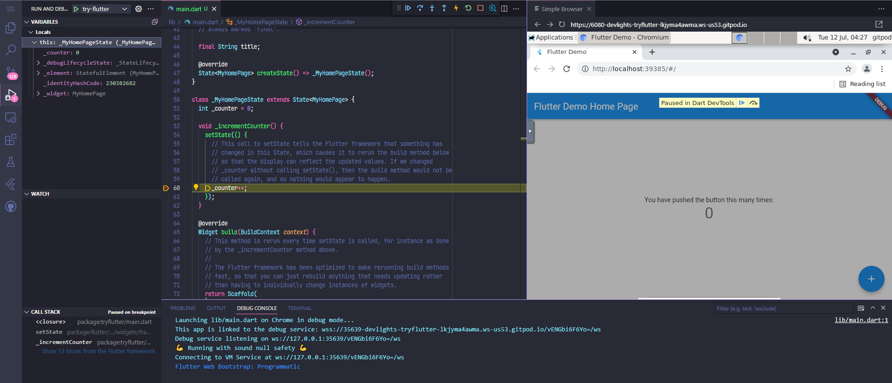

# try-flutter

This is my TUTORIAL project for flutter.

This project is intended to run on gitpod.

## flutter version

```sh
gitpod /workspace/try-flutter (main) $ flutter --version
Flutter 3.16.3 • channel stable • https://github.com/flutter/flutter.git
Framework • revision b0366e0a3f (27 hours ago) • 2023-12-05 19:46:39 -0800
Engine • revision 54a7145303
Tools • Dart 3.2.3 • DevTools 2.28.4
```

## flutter doctor

```sh
gitpod /workspace/try-flutter (main) $ flutter doctor
Doctor summary (to see all details, run flutter doctor -v):
[✓] Flutter (Channel stable, 3.16.3, on Ubuntu 22.04.3 LTS 6.1.57-060157-generic, locale en_US.UTF-8)
[✓] Chrome - develop for the web
[!] Flutter IDE Support (No supported IDEs installed)
[✓] Connected device (1 available)
[✓] Network resources

! Doctor found issues in 1 category.

gitpod /workspace/try-flutter (main) $ flutter config --list
All Settings:
  enable-web: true
  enable-linux-desktop: false
  enable-macos-desktop: false
  enable-windows-desktop: false
  enable-android: false
  enable-ios: false
  enable-fuchsia: (Not set) (Unavailable)
  enable-custom-devices: (Not set)
  cli-animations: (Not set)
  enable-native-assets: (Not set) (Unavailable)
```

## Run

```sh
gitpod /workspace/try-flutter (main) $ flutter run
```

After a while, an application will be launched on VNC, and VNC will be assigned to port 6080, so open it.

Debugging and Hot Reload features can be done normally. Thanks Gitpod!! :)




## References

- [try-dart](https://github.com/devlights/try-dart)
  - This is my TUTORIAL project for dart.
- [gitpod-io/template-flutter](https://github.com/gitpod-io/template-flutter)
  - The gitpod.yml and gitpod.Dockerfile are copied from this repository.
  - ~~If used as is, apt-get will generate an error and the pre-build will not succeed, so I adjusted the Dockerfile based on the contents of https://github.com/gitpod-io/workspace-images/issues/872.~~
